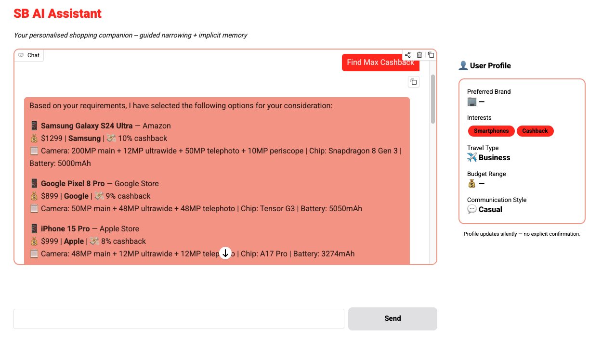

# SB AI Shopping Assistant

**An agentic AI prototype that transforms SB's cashback platform into a personalised shopping companion.**

---



> **Note:** The User Profile panel on the right side of the demo is for demonstration purposes only. In a production environment, users would only see the chat area — preferences are captured and applied silently in the background.

---

## Live Demo

Try the prototype instantly — no setup required:

**[https://lituokobe-sb-ai-assistant.hf.space/](https://lituokobe-sb-ai-assistant.hf.space/)**

The demo showcases three happy paths that highlight the core capabilities:

### Happy Path 1: Digital Shopping — Guided Narrowing

1. Type: *"I want to buy a phone with a good camera."*
2. Three quick-tap buttons appear: **Look for a Brand**, **Compare Models**, **Find Max Cashback**.
3. Click **Find Max Cashback**.
4. The assistant returns phone options sorted by cashback rate (highest first), each with verified cashback percentages.
5. Watch the **User Profile** panel on the right — "Smartphones" and "Cashback" appear under Interests, captured silently from the query and button click.

### Happy Path 2: Travel Planning — Multi-Round Scoping

1. Type: *"I want to book a trip to Sydney."*
2. Trip-type buttons appear: **Family Trip**, **Business Trip**, **Leisure Trip**.
3. Click **Business Trip**.
4. Text fields for group size and travel dates appear.
5. Fill in the details and click **Submit**.
6. The assistant returns curated Sydney business travel packages with cashback rates.
7. Watch the **User Profile** panel — "Business" appears under Travel Type.

### Happy Path 3: Communication Style — Tone Adaptation

1. Type: *"Talk to me in a casual tone."*
2. The assistant responds in a casual tone: *"Sure thing! I'll keep it chill from now on."*
3. Watch the **User Profile** panel — "Casual" appears under Communication Style.
4. All subsequent responses adopt the casual tone automatically.

---

## Key Features

### Guided Narrowing with Quick-Tap Buttons

Instead of returning a wall of links, the assistant routes each query to a vertical (Digital or Travel) and presents **pre-designed quick-tap buttons** that progressively narrow the user's intent in a maximum of two clicks. This transforms an open-ended search into a structured, low-friction conversation.

| Round | Digital Flow Example | Travel Flow Example |
|-------|---------------------|---------------------|
| 1 | "Look for a Brand" / "Compare Models" / "Find Max Cashback" | "Family Trip" / "Business Trip" / "Leisure Trip" |
| 2 | — (immediate search) | Group size + travel dates (text fields) |

### Implicit User Profiling

The assistant **silently captures preferences** from natural conversation and button clicks — brand affinity, product interests, travel type, and communication style — without ever asking "Can I update your profile?" The profile shapes future responses through the context window, making the assistant feel like it remembers the user across sessions.

| Signal Source | Profile Field Updated |
|--------------|----------------------|
| "I want to buy a phone with a good camera" | Interests → Smartphones |
| Clicking "Find Max Cashback" | Interests → Cashback |
| Clicking "Business Trip" | Travel Type → Business |
| "Talk to me in a casual tone" | Communication Style → Casual |

All profile updates happen passively — the user never sees a form or a prompt.

### Deterministic & Repeatable

All LLM outputs and product data are **deterministically mocked** — no external API calls are made. This ensures every demo produces the same high-quality result, making it ideal for interviews and stakeholder presentations.

---

## Architecture

The prototype follows a strict three-tier separation to mirror a production environment:

```text
┌─────────────────┐      HTTP/JSON      ┌─────────────────┐                    ┌─────────────────┐
│  Gradio Frontend │  <===============>  │  FastAPI Gateway │  <=== State ====>  │  LangGraph Core │
│  (Chat UI +      │                      │  (Pydantic V2    │                    │  (Router,       │
│   Profile Panel) │                      │   Contracts)     │                    │   Scoping,      │
└─────────────────┘                      └─────────────────┘                    │   Guardrails)   │
                                                                                 └────────┬────────┘
                                                                                          │ Read
                                                                                 ┌────────▼────────┐
                                                                                 │   Mock Data     │
                                                                                 │   (Products,    │
                                                                                 │    Profiles,    │
                                                                                 │    LLM Output)  │
                                                                                 └─────────────────┘
```

### Agentic Pipeline

```text
START → [router] ── classifies intent ──────────────────────────────────────────────────────
                 │
                 ├── com_style ──────► [profile] ──► [response] ──► END
                 │
                 ├── general ────────► [response] ──► [profile] ──► END
                 │
                 └── digital/travel ─► [scoping] ──┬── (more scoping) ──► [profile] ──► END
                                                   │
                                                   └── (scoping done) ──► [search] ──► [guardrail]
                                                                          ─► [response] ──► [profile] ──► END
```

**Key behaviours:**

- **Iterative scoping:** Travel queries require two rounds (buttons → text fields). Digital queries complete in one round.
- **Implicit capture on every turn:** The profile node runs after scoping generates buttons, so interests are captured immediately — not delayed until the search completes.
- **Post-generation guardrails:** A deterministic validation layer filters out irrelevant products and verifies cashback rates before display.
- **Session persistence:** A LangGraph `MemorySaver` checkpointer preserves conversation state across HTTP requests, enabling the multi-turn scoping loop.

## Tech Stack

| Layer | Technology | Purpose |
|-------|-----------|---------|
| Language | Python 3.13 | Strict type hinting, modern async features |
| Package Manager | uv | Ultra-fast dependency resolution |
| Agentic Framework | LangGraph | Stateful graph with conditional routing |
| API Gateway | FastAPI + Uvicorn | Pydantic V2 contract enforcement |
| Frontend | Gradio 6 | Conversational UI with company branding |
| HTTP Client | HTTPX | Async frontend-to-backend communication |
| Data Validation | Pydantic V2 | Strict API contracts and domain models |

---

## Getting Started

### Option 1: Live Demo (No Setup)

Visit **[https://lituokobe-sb-ai-assistant.hf.space/](https://lituokobe-sb-ai-assistant.hf.space/)** and follow the three happy paths described in the [Live Demo](#live-demo) section above.

### Option 2: Run Locally

#### Prerequisites

- Python 3.13+
- [uv](https://docs.astral.sh/uv/) package manager

```bash
# Install uv if needed
curl -LsSf https://astral.sh/uv/install.sh | sh
```

#### Installation

```bash
git clone https://github.com/lituokobe/SB-AI-Assistant.git
cd SB-AI-Assistant
uv sync
```

#### Running the Application

**Terminal 1 — Backend (FastAPI + LangGraph):**

```bash
uv run uvicorn backend.main:app --reload --port 8000
```

API documentation is available at `http://localhost:8000/docs`.

**Terminal 2 — Frontend (Gradio):**

```bash
uv run python frontend/app.py
```

Open `http://localhost:7860` in your browser.

### Option 3: Deploy to Hugging Face Spaces

The project includes a deployment script that creates a clean orphan branch (excluding binary files) and force-pushes to Hugging Face Spaces:

```bash
# Prerequisites:
#   1. Create a Space at https://huggingface.co/new-space (SDK: Gradio)
#   2. Add the Space as a git remote:
#      git remote add space https://huggingface.co/spaces/<your-username>/<your-space-name>
#   3. Store your HF access token in git credentials:
#      git push space main  # prompts for username (HF username) and password (token)

./deploy_hf.sh
```

The script automatically:
- Removes binary files (UI_demo.png) from the deployment (HF rejects them in git history)
- Injects Hugging Face Spaces YAML metadata into README.md (hidden from GitHub)
- Force-pushes a clean commit to the Space

---

## Testing

The project includes 8 integration tests that validate the complete flow:

```bash
uv run python test_flows.py
```

Tests cover:

| # | Test | Validates |
|---|------|-----------|
| 1 | Health check | API server is running |
| 2 | Digital flow | Phone search with guided narrowing + profile capture |
| 3 | Travel flow | Multi-round scoping (buttons → fields) + profile capture |
| 4 | Communication style | Tone change + profile update |
| 5 | General flow | Greeting routing |
| 6 | Cashback sorting | Products sorted by cashback rate (descending) |
| 7 | Guardrail filtering | No irrelevant categories in results |
| 8 | Formal tone | Default responses use formal tone before explicit change |

---

## Project Structure

```text
sb-ai-assistant/
├── backend/
│   ├── api/                # FastAPI routes, dependencies, Pydantic contracts
│   ├── graph/
│   │   ├── nodes/          # LangGraph nodes (router, scoping, search, guardrail, response, profile)
│   │   ├── builder.py      # Graph compilation with conditional edges
│   │   └── state.py        # TypedDict state definition
│   ├── memory/             # Profile persistence and context assembly
│   ├── main.py             # FastAPI app entry point
│   └── models.py           # Pydantic V2 domain models and API contracts
├── frontend/
│   ├── components/         # Chatbot handlers and sidebar renderer
│   ├── api_client.py       # Async HTTPX client for backend calls
│   └── app.py              # Gradio UI assembly and launch
├── mocks/
│   ├── llm_responses.py    # Mocked LLM output templates (formal + casual)
│   ├── products.json       # Mocked product and travel package catalogue
│   └── user_profiles.json  # Mocked user profile store
├── test_flows.py           # Integration test suite (8 tests)
└── pyproject.toml          # uv project configuration
```

---

## Design Principles

1. **Show, don't tell** — The assistant never says "I've updated your profile." Preferences are captured silently and surface through behaviour.
2. **Progressive disclosure** — The user is never overwhelmed with options. Each scoping round presents a small, focused set of choices.
3. **Deterministic by design** — All LLM outputs and data are mocked, ensuring every demo produces the same high-quality result.
4. **Separation of concerns** — UI logic lives in the frontend, business logic in the graph, and data contracts in Pydantic models. The frontend never touches LangGraph directly.
